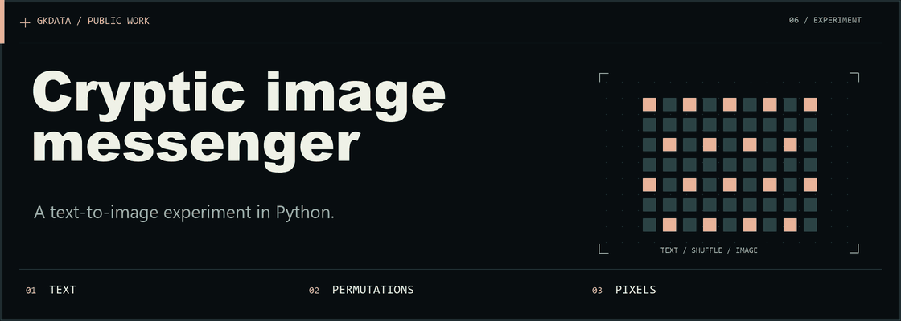
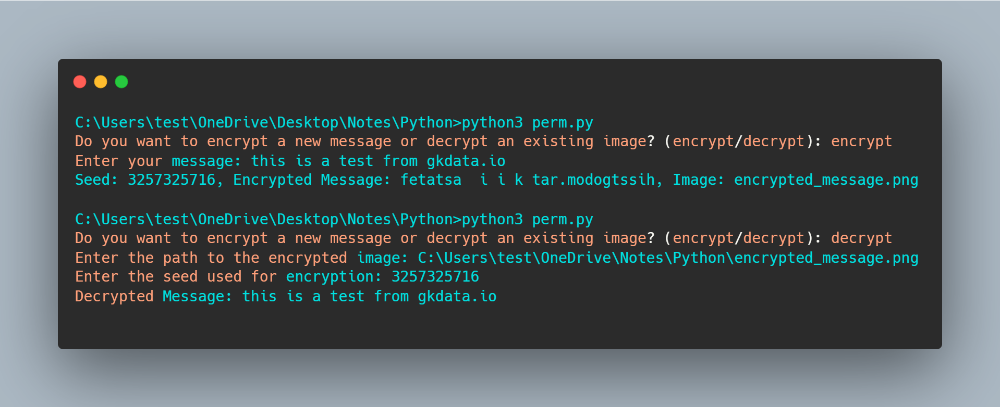
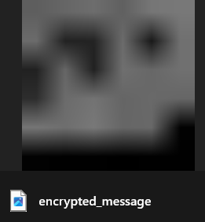
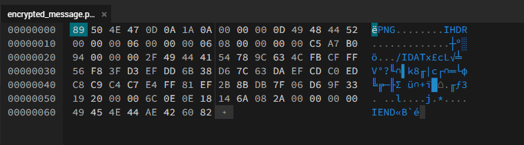

<picture>
  <source media="(prefers-reduced-motion: reduce) and (max-width: 600px)" srcset="docs/assets/readme/hero-mobile-static.png">
  <source media="(prefers-reduced-motion: reduce)" srcset="docs/assets/readme/hero-static.png">
  <source media="(max-width: 600px)" srcset="docs/assets/readme/hero-mobile.gif">
  
</picture>

# Cryptic Image Messenger

A Python experiment that shuffles a message using a seed, stores character values as grayscale pixels, and reverses the process. It demonstrates permutations and image encoding; it does not provide modern cryptographic security.

[How it works](#features) · [Requirements](#requirements) · [Screenshots](#screenshots)

## Features

- **Encode**: Rearranges message characters and writes their values into an image.
- **Decode**: Reads the pixel values and applies the inverse permutation.
- **Seeded permutation**: The same seed reconstructs the character order.

## Requirements

- Python 3.x
- Pillow (PIL) library

You can install the required library using pip:
```bash
pip install pillow
```

## Screenshots






